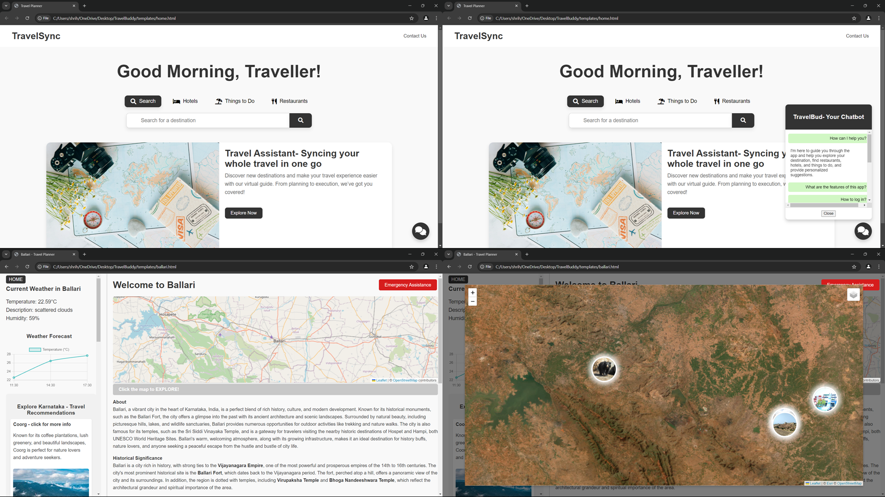
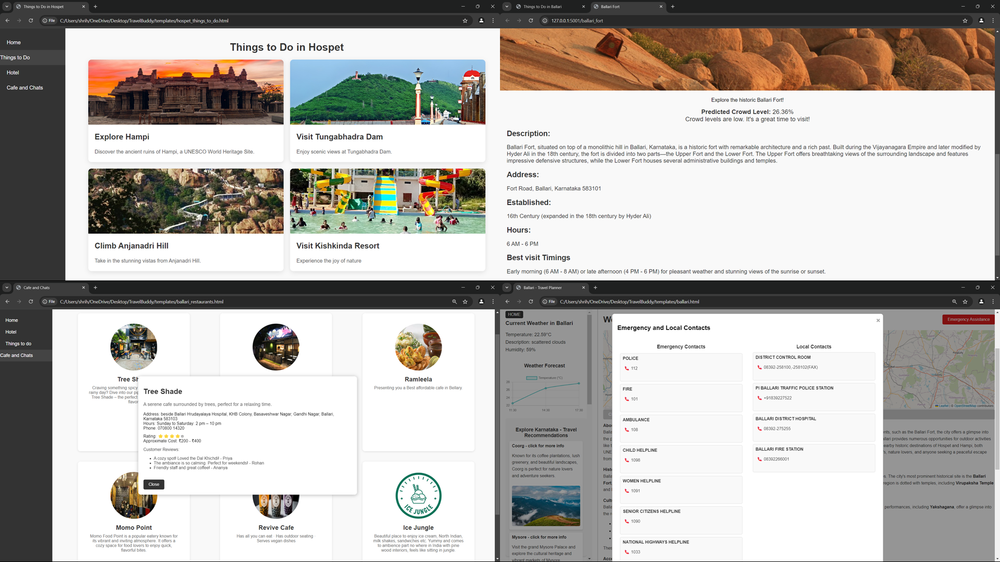
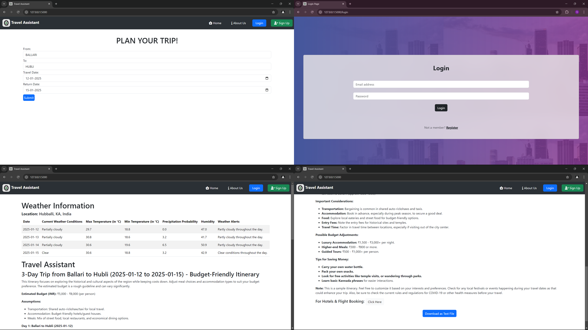

# TravelSync - Your Smart Travel Buddy  

## Overview  
**TravelSync** is a smart travel assistance platform powered by **Machine Learning (ML)** and **Generative AI (GenAI)**. It is designed to simplify and enhance travel planning by offering real-time data, AI-driven recommendations, and key tools for a seamless experience. The platform addresses inefficiencies in traditional travel planning by integrating multiple functionalities into one comprehensive solution.  

Key features include real-time weather updates, crowd density predictions, personalized itinerary generation, and interactive chatbot assistance. These features are enhanced by geolocation services and dynamic recommendations for attractions, making it an intuitive and reliable travel planning tool.  

---

## Features  
1. **Real-Time Weather Tracking:** Accurate and up-to-date weather forecasts to help users plan activities effectively.  
2. **Crowd Density Predictions:** Predicts crowd levels at destinations using Artificial Neural Networks (ANN) trained on historical and real-time data.  
3. **Personalized Itinerary Creation:** Generates customized travel plans based on user preferences, optimized routes, and selected attractions.  
4. **AI-Powered Chatbot:** Provides 24/7 assistance for queries, itinerary updates, and general travel information.  
5. **Travel Recommendations for Karnataka State:** Curated suggestions to boost tourism in Karnataka, highlighting key destinations and attractions.  
6. **Emergency Assistance:** Provides local and national emergency contacts for services such as hospitals, police, and other essential help.  
7. **Geolocation Services:** Offers navigation support, nearby attraction discovery, and emergency contact information.  
8. **Interactive Maps:** Highlights key attractions, routes, and points of interest using integrated APIs.  

---

## Technology Used  
- **Frontend:** HTML, CSS, JavaScript  
- **Backend:** Python (Flask/Django)  
- **Machine Learning:** TensorFlow/Keras for ANN models  
- **Database:** SQLite for user data and preferences  
- **APIs:** OpenWeatherMap  

---

## Dataset  
- **Extended Travel Planner Data:** `extended_travel_planner_data_25000_ballari.csv` (3.63 MB)  

---

## Installation and Setup  

### Prerequisites  
1. Python 3.10+  
2. Virtual Environment (optional but recommended)  

### Steps  
1. **Clone the repository:**  
   ```bash  
   git clone <repository-url>  
   cd TravelBuddy  
   ```  
2. **Set up a virtual environment:**  
   ```bash  
   python -m venv env  
   source env/bin/activate   # For Linux/Mac  
   env\Scripts\activate      # For Windows  
   ```  
3. **Install dependencies:**  
   ```bash  
   pip install -r Virtual\ Guide/requirements.txt  
   ```  
4. **Set up environment variables:**  
   - Configure the `.env` file in `Virtual Guide/` with necessary keys.  
5. **Run the application:**  
   ```bash  
   python Virtual\ Guide/app.py  
   ```  
6. **Access the application:**  
   Make sure the Flask applications (`app.py` at `http://127.0.0.1:5001` and `wsgi.py` at `http://127.0.0.1:5000`) are running before launching the project (host it through `travelsync.html`).  

---

## How to Use  

1. The platform is **free and open-source**; no login is required to use most features.  
2. On the homepage, users can search for destinations or travel places. The chatbot is accessible directly from the homepage for real-time assistance.  
3. **Destination Search:**  
   - Redirects to a dedicated destination page that includes:  
     - Description of the destination  
     - Weather information  
     - Recommendations  
     - Travel attractions mapped with actual coordinates  
     - Exploration options for hotels, restaurants, and activities, with real-time crowd predictions.  
4. **Travel Assistant (Virtual Guide):**  
   - Input travel details, including duration, dates, and start/end locations.  
   - Generates a complete itinerary with day-wise plans, including weather forecasts.  
   - Itineraries can be downloaded in text format for customization.  
   - Logged-in users receive personalized recommendations.  

---

## Project Structure  
- **Main Directory:** Contains all project files, including datasets, scripts, and web application files.  
- **Virtual Guide:** Web application implementation, static files, and templates.  
- **Datasets:** Core data used for travel planning.  
- **Machine Learning:** Scripts for preprocessing, training, and prediction.  

---

## Results  
- **Weather Tracking:** Delivered accurate updates with an average response time of 200ms.  
- **Crowd Predictions:** Low Mean Squared Error (MSE) confirmed the reliability of predictions.  
- **Interactive Features:** User-friendly tools like AI travel planners and geolocation services were commended for enhancing the travel experience.  
- **Platform Performance:** Load times were optimized to under three seconds, improving user satisfaction.  

---

## Screenshots  

### 1. Homepage  
The main interface where users can search for destinations and access real-time travel assistance.  
  

### 2. Things to Do and Crowd Prediction  
Detailed destination page showing attractions, recommendations, and real-time crowd density predictions.  
  

### 3. Travel Assistant  
A virtual guide that generates personalized itineraries and provides day-wise travel plans with weather forecasts.  
  
  
---

## Future Enhancements  
1. Include multi-language support for international users.  
2. Add live traffic updates for better route planning.  
3. Expand data coverage to include more locations globally.  
4. Enhance the ANN model with additional datasets for improved accuracy.  

---

## Project Associates  
1. Shreeharsh Joshi  
2. Shreyas C  
3. Sinchana Poojary  
4. Sreevalli R  
